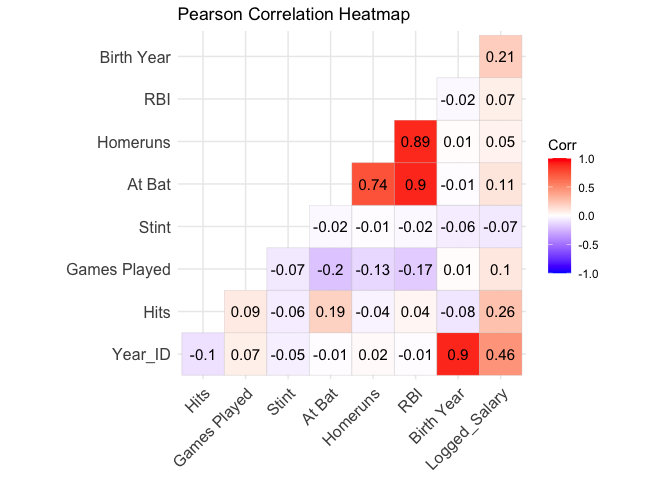

README
================

## Introduction

As college students, we are constantly busy with classes, homeworks, and
exams. We are all very involved in extracurricular activities outside of
classes, which takes up a lot of time. However, in the free time that we
do have, we love to get together with our friends and watch sports
games. Whether it is the fall semester or the spring semester, there is
always a sport being played (football in the fall, basketball in the
winter, baseball in the spring). Since this project is being completed
in the spring season, we decided to focus our attention on baseball.

Specifically, we are interested in learning more about what influences a
baseball player’s salary. Is it their batting average? Their experience?
Their age? The team they play for? We will analyze these variables, plus
many others, and how they influence a player’s salary. In this case, we
are interested in assessing the following question: What best influences
a hitters’ baseball player’s salary?

To start, we will understand the data by reading literature about
impacts on a baseball player’s salary. This will allow us to absorb the
material we are trying to learn more about before actually starting to
import and analyze the data into an open source data software. Then, we
will provide some descriptive and numeric statistics of the dataset we
collected. This will help provide an overview of the important features
of the variables. Next, we will do some exploratory data analysis,
analyzing any correlations between the independent variables of interest
and the dependent variable. We will utilize plots and graphs to help us
visualize the data. Finally, we will use machine learning models to see
what the best way to identify patterns, make predictions, and improve
its performance over time.

We will calculate the batting average by dividing each player’s total
hits per season by their total at-bat. This batting average is different
because a hit is a batter reaching first base. It is a good starting
point for evaluating a player’s offensive skills. A higher batting
average suggests a batter is more consistent in making solid contact
with the ball and getting on base via hits.

## Data Organization

Data was collected using a website called Baseball Reference, which has
baseball history and statistics for Major League Baseball. It is the
complete source for current and historical baseball players, teams,
scores, and leaders. Specifically, our dataset focuses on statistics
from 1985, showing individuals’ performance, age, and other relevant
information for a singular season.

According to the Bureau Labor of Statistics, salary trends change over
time. With free agencies and salary arbitration, salaries escalate. In
addition, TV revenues fuel salary expansion, as the League has more
money to work with. In order to understand how much a team can spend on
its players, it is important to understand the distribution of their
money. For the owners, player compensation looks like this: Major League
Player Compensation + Benefit Plan Costs + Postseason Share Payments +
Minor League Signing Bonuses (not including associated tax) + Minor
League Salaries And Benefits.

So, in order to comprehend the salary of an individual player, we must
take this distribution into account. Salaries to the players themselves
are comparable to salaries in the entertainment industry: star
performers disproportionately earn higher amounts. These higher amounts
are influenced by performance, seniority, and market size, with
performance being the dominant factor.

After filtering the data by removing the irrelevant attributes to our
analysis, these are the attributes included in our data, as well as
their data type:

### Feature Descriptions for Baseball Data

| Feature       | Description                            | Scale_Type |
|:--------------|:---------------------------------------|:-----------|
| Player_ID     | Player ID                              | Character  |
| Year_ID       | Year ID                                | Ordinal    |
| Hits          | Number of hits per season              | Interval   |
| Games Played  | Games played per season                | Interval   |
| Stint         | How many years player has been on team | Interval   |
| At Bat        | Number of times at bat per season      | Interval   |
| Homeruns      | Home runs per season                   | Interval   |
| RBI           | Runs Batted In per season              | Interval   |
| Birth Year    | Birth Year                             | Interval   |
| Logged_Salary | Yearly salary in dollars, logged       | Ratio      |

Some of the players in the dataset were pitchers and not hitters, so we
had to remove rows with NA values for hits in order to only look at the
hitters.

<table class="table table-striped table-hover" style="width: auto !important; margin-left: auto; margin-right: auto;">
<caption>
Detailed Summary Statistics
</caption>
<thead>
<tr>
<th style="text-align:left;">
Variable
</th>
<th style="text-align:right;">
Count
</th>
<th style="text-align:right;">
Mean
</th>
<th style="text-align:right;">
Median
</th>
<th style="text-align:right;">
SD
</th>
<th style="text-align:right;">
Min
</th>
<th style="text-align:right;">
Max
</th>
</tr>
</thead>
<tbody>
<tr>
<td style="text-align:left;">
Hits
</td>
<td style="text-align:right;">
11953
</td>
<td style="text-align:right;">
88.6848490
</td>
<td style="text-align:right;">
65.0000
</td>
<td style="text-align:right;">
67.1299314
</td>
<td style="text-align:right;">
0.0000
</td>
<td style="text-align:right;">
284.00000
</td>
</tr>
<tr>
<td style="text-align:left;">
Games Played
</td>
<td style="text-align:right;">
11953
</td>
<td style="text-align:right;">
33.9375889
</td>
<td style="text-align:right;">
32.0000
</td>
<td style="text-align:right;">
20.4525020
</td>
<td style="text-align:right;">
1.0000
</td>
<td style="text-align:right;">
94.00000
</td>
</tr>
<tr>
<td style="text-align:left;">
Stint
</td>
<td style="text-align:right;">
11953
</td>
<td style="text-align:right;">
1.0087007
</td>
<td style="text-align:right;">
1.0000
</td>
<td style="text-align:right;">
0.1014846
</td>
<td style="text-align:right;">
1.0000
</td>
<td style="text-align:right;">
4.00000
</td>
</tr>
<tr>
<td style="text-align:left;">
At Bat
</td>
<td style="text-align:right;">
11953
</td>
<td style="text-align:right;">
14.4105246
</td>
<td style="text-align:right;">
1.0000
</td>
<td style="text-align:right;">
38.0810457
</td>
<td style="text-align:right;">
0.0000
</td>
<td style="text-align:right;">
593.00000
</td>
</tr>
<tr>
<td style="text-align:left;">
Homeruns
</td>
<td style="text-align:right;">
11953
</td>
<td style="text-align:right;">
0.1258262
</td>
<td style="text-align:right;">
0.0000
</td>
<td style="text-align:right;">
0.9721162
</td>
<td style="text-align:right;">
0.0000
</td>
<td style="text-align:right;">
33.00000
</td>
</tr>
<tr>
<td style="text-align:left;">
RBI
</td>
<td style="text-align:right;">
11953
</td>
<td style="text-align:right;">
1.0046014
</td>
<td style="text-align:right;">
0.0000
</td>
<td style="text-align:right;">
4.3189322
</td>
<td style="text-align:right;">
0.0000
</td>
<td style="text-align:right;">
123.00000
</td>
</tr>
<tr>
<td style="text-align:left;">
Birth Year
</td>
<td style="text-align:right;">
11953
</td>
<td style="text-align:right;">
1971.9335732
</td>
<td style="text-align:right;">
1972.0000
</td>
<td style="text-align:right;">
9.6556476
</td>
<td style="text-align:right;">
1939.0000
</td>
<td style="text-align:right;">
1995.00000
</td>
</tr>
<tr>
<td style="text-align:left;">
Logged_Salary
</td>
<td style="text-align:right;">
11953
</td>
<td style="text-align:right;">
13.5320265
</td>
<td style="text-align:right;">
13.1869
</td>
<td style="text-align:right;">
1.3606015
</td>
<td style="text-align:right;">
11.0021
</td>
<td style="text-align:right;">
17.31202
</td>
</tr>
</tbody>
</table>

## Exploratory Data Analysis

### Distribution of Variables

<!-- --><!-- --><!-- --><!-- --><!-- --><!-- --><!-- --><!-- -->

Both variables are not normally distributed, so we cannot run tests that
assume normality, such as the Shapiro-Wilk test or Q-Q plots. Instead,
we would use the Pearson Correlation test.

### Pearson Correlation heatmap

Before running any exploratory analysis, we decided to see if there are
any strong correlations that stand out for our independent variables of
interest and our dependent variable, logged salary. According to the
heatmap scale, the more correlated the variables are, the darker the
color will be. We also have the actual correlations between the
variables presented in each box.

<!-- -->

Surprisingly, we found that there are not many strong correlations
between the variables of interest and our dependent variable. Even
though the strongest correlation between an independent variable and
salary is Year ID at .46, this is not helpful to our interpretation of
how strongly the data is correlated since we are including this variable
to represent that this is not time series data. Therefore, this
correlation is not important. The next strongest correlation is for the
independent variable, hits, with a correlation coefficient of .26. This
means that out of all the independent variables we looked at, hits are
most likely to predict the outcome of a players’ salary. This is as
expected, as the more hits a player has, the more likely they are going
to get paid higher salaries, since their overall performance is high.
The correlation of 0.21 between Birth Year and logged salary is moderate
and positive, meaning that players who are older (i.e., having a higher
birth year number) tend to have higher logged salaries. This might
reflect the effect of experience and seniority, as older players may
earn higher salaries due to their experience in the league.The
correlation between At Bat and logged salary is 0.11, which indicates a
weak positive relationship. This implies that while there is a slight
tendency for players with more at-bats to have a higher logged salary,
the relationship is not substantial.

### Check statistical significance of variables

    ## 
    ## Call:
    ## lm(formula = Logged_Salary ~ Hits + `Games Played` + Stint + 
    ##     `At Bat` + Homeruns + RBI + `Birth Year`, data = hitters_data)
    ## 
    ## Residuals:
    ##     Min      1Q  Median      3Q     Max 
    ## -3.0593 -1.0246 -0.2064  0.9777  3.6905 
    ## 
    ## Coefficients:
    ##                  Estimate Std. Error t value Pr(>|t|)    
    ## (Intercept)    -5.015e+01  2.396e+00 -20.930   <2e-16 ***
    ## Hits            5.279e-03  1.882e-04  28.044   <2e-16 ***
    ## `Games Played`  5.830e-03  5.859e-04   9.950   <2e-16 ***
    ## Stint          -3.753e-01  1.150e-01  -3.263   0.0011 ** 
    ## `At Bat`        8.524e-04  7.834e-04   1.088   0.2766    
    ## Homeruns        1.517e-02  2.704e-02   0.561   0.5746    
    ## RBI             1.583e-02  9.548e-03   1.658   0.0973 .  
    ## `Birth Year`    3.213e-02  1.210e-03  26.567   <2e-16 ***
    ## ---
    ## Signif. codes:  0 '***' 0.001 '**' 0.01 '*' 0.05 '.' 0.1 ' ' 1
    ## 
    ## Residual standard error: 1.268 on 11945 degrees of freedom
    ## Multiple R-squared:  0.1322, Adjusted R-squared:  0.1317 
    ## F-statistic: 260.1 on 7 and 11945 DF,  p-value: < 2.2e-16

### Check Assumptions

<!-- -->

    ## Loading required package: zoo

    ## 
    ## Attaching package: 'zoo'

    ## The following objects are masked from 'package:base':
    ## 
    ##     as.Date, as.Date.numeric

    ## 
    ##  studentized Breusch-Pagan test
    ## 
    ## data:  model_sig
    ## BP = 328.89, df = 4, p-value < 2.2e-16

    ##           Hits `Games Played`          Stint   `Birth Year` 
    ##       1.018296       1.012060       1.012046       1.010262

Linearity:

Breusch-Pagan Test: Interpretation: The very small p-value (\< 0.05)
strongly suggests that the residuals do not have constant variance —
i.e., heteroscedasticity is present. Why it matters: This can lead to
inefficient estimates and invalid p-values, so it’s a critical issue.
Fix: Use robust standard errors when reporting inference

Variance Inflation Factor: Interpretation: All VIFs are very close to 1,
indicating no multicollinearity. No action needed — this assumption is
met.

### Scatterplots of statistically significant variables

    ## `geom_smooth()` using formula = 'y ~ x'

<!-- -->

    ## `geom_smooth()` using formula = 'y ~ x'

<!-- -->

    ## `geom_smooth()` using formula = 'y ~ x'

<!-- -->

    ## `geom_smooth()` using formula = 'y ~ x'

<!-- -->

## Conclusions

## Main Observations

## Future Directions
