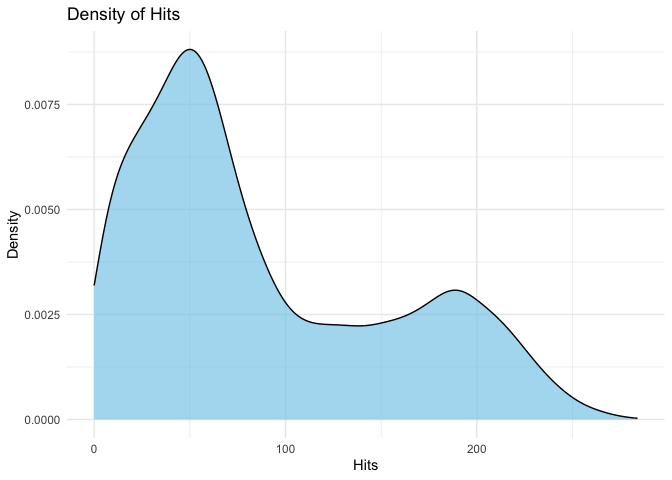
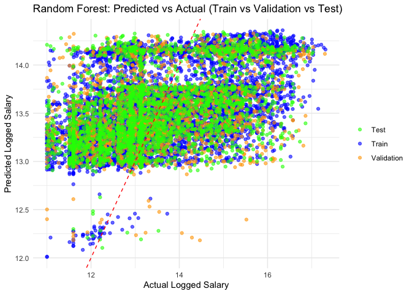

README
================

By Isabel Choma, Isabella Reid, Kiley Meringer, and Sophia Hess

## Introduction

As college students, we are constantly busy with classes, homeworks, and
exams. We are all very involved in extracurricular activities outside of
classes, which takes up a lot of time. However, in the free time that we
do have, we love to get together with our friends and watch sports
games. Whether it is the fall semester or the spring semester, there is
always a sport being played (football in the fall, basketball in the
winter, baseball in the spring). Since this project is being completed
in the spring season, we decided to focus our attention on baseball.

Specifically, we are interested in learning more about what influences a
baseball player’s salary. Is it their batting average? Their experience?
Their age? The team they play for? We will analyze these variables, plus
many others, and how they influence a player’s salary. In this case, we
are interested in assessing the following question: What best influences
a hitters’ baseball player’s salary?

To start, we will understand the data by reading literature about
impacts on a baseball player’s salary. This will allow us to absorb the
material we are trying to learn more about before actually starting to
import and analyze the data into an open source data software. Then, we
will provide some descriptive and numeric statistics of the dataset we
collected. This will help provide an overview of the important features
of the variables. Next, we will do some exploratory data analysis,
analyzing any correlations between the independent variables of interest
and the dependent variable. We will utilize plots and graphs to help us
visualize the data. Finally, we will use machine learning models to see
what the best way to identify patterns, make predictions, and improve
its performance over time.

We will calculate the batting average by dividing each player’s total
hits per season by their total at-bat. This batting average is different
because a hit is a batter reaching first base. It is a good starting
point for evaluating a player’s offensive skills. A higher batting
average suggests a batter is more consistent in making solid contact
with the ball and getting on base via hits.

## Data Organization

Data was collected using a website called Baseball Reference, which has
baseball history and statistics for Major League Baseball. It is the
complete source for current and historical baseball players, teams,
scores, and leaders. Specifically, our dataset focuses on statistics
from 1985, showing individuals’ performance, age, and other relevant
information for a singular season.

According to the Bureau Labor of Statistics, salary trends change over
time. With free agencies and salary arbitration, salaries escalate. In
addition, TV revenues fuel salary expansion, as the League has more
money to work with. In order to understand how much a team can spend on
its players, it is important to understand the distribution of their
money. For the owners, player compensation looks like this: Major League
Player Compensation + Benefit Plan Costs + Postseason Share Payments +
Minor League Signing Bonuses (not including associated tax) + Minor
League Salaries And Benefits.

So, in order to comprehend the salary of an individual player, we must
take this distribution into account. Salaries to the players themselves
are comparable to salaries in the entertainment industry: star
performers disproportionately earn higher amounts. These higher amounts
are influenced by performance, seniority, and market size, with
performance being the dominant factor.

After filtering the data by removing the irrelevant attributes to our
analysis, these are the attributes included in our data, as well as
their data type:

### Feature Descriptions for Baseball Data

| Feature       | Description                            | Scale_Type |
|:--------------|:---------------------------------------|:-----------|
| Player_ID     | Player ID                              | Character  |
| Year_ID       | Year ID                                | Ordinal    |
| Hits          | Number of hits per season              | Interval   |
| Games Played  | Games played per season                | Interval   |
| Stint         | How many years player has been on team | Interval   |
| At Bat        | Number of times at bat per season      | Interval   |
| Homeruns      | Home runs per season                   | Interval   |
| RBI           | Runs Batted In per season              | Interval   |
| Birth Year    | Birth Year                             | Interval   |
| Logged_Salary | Yearly salary in dollars, logged       | Ratio      |

Some of the players in the dataset were pitchers and not hitters, so we
had to remove rows with NA values for hits in order to only look at the
hitters.

<table class="table table-striped table-hover" style="width: auto !important; margin-left: auto; margin-right: auto;">
<caption>
Detailed Summary Statistics
</caption>
<thead>
<tr>
<th style="text-align:left;">
Variable
</th>
<th style="text-align:right;">
Count
</th>
<th style="text-align:right;">
Mean
</th>
<th style="text-align:right;">
Median
</th>
<th style="text-align:right;">
SD
</th>
<th style="text-align:right;">
Min
</th>
<th style="text-align:right;">
Max
</th>
</tr>
</thead>
<tbody>
<tr>
<td style="text-align:left;">
Hits
</td>
<td style="text-align:right;">
11953
</td>
<td style="text-align:right;">
88.6848490
</td>
<td style="text-align:right;">
65.0000
</td>
<td style="text-align:right;">
67.1299314
</td>
<td style="text-align:right;">
0.0000
</td>
<td style="text-align:right;">
284.00000
</td>
</tr>
<tr>
<td style="text-align:left;">
Games Played
</td>
<td style="text-align:right;">
11953
</td>
<td style="text-align:right;">
33.9375889
</td>
<td style="text-align:right;">
32.0000
</td>
<td style="text-align:right;">
20.4525020
</td>
<td style="text-align:right;">
1.0000
</td>
<td style="text-align:right;">
94.00000
</td>
</tr>
<tr>
<td style="text-align:left;">
Stint
</td>
<td style="text-align:right;">
11953
</td>
<td style="text-align:right;">
1.0087007
</td>
<td style="text-align:right;">
1.0000
</td>
<td style="text-align:right;">
0.1014846
</td>
<td style="text-align:right;">
1.0000
</td>
<td style="text-align:right;">
4.00000
</td>
</tr>
<tr>
<td style="text-align:left;">
At Bat
</td>
<td style="text-align:right;">
11953
</td>
<td style="text-align:right;">
14.4105246
</td>
<td style="text-align:right;">
1.0000
</td>
<td style="text-align:right;">
38.0810457
</td>
<td style="text-align:right;">
0.0000
</td>
<td style="text-align:right;">
593.00000
</td>
</tr>
<tr>
<td style="text-align:left;">
Homeruns
</td>
<td style="text-align:right;">
11953
</td>
<td style="text-align:right;">
0.1258262
</td>
<td style="text-align:right;">
0.0000
</td>
<td style="text-align:right;">
0.9721162
</td>
<td style="text-align:right;">
0.0000
</td>
<td style="text-align:right;">
33.00000
</td>
</tr>
<tr>
<td style="text-align:left;">
RBI
</td>
<td style="text-align:right;">
11953
</td>
<td style="text-align:right;">
1.0046014
</td>
<td style="text-align:right;">
0.0000
</td>
<td style="text-align:right;">
4.3189322
</td>
<td style="text-align:right;">
0.0000
</td>
<td style="text-align:right;">
123.00000
</td>
</tr>
<tr>
<td style="text-align:left;">
Birth Year
</td>
<td style="text-align:right;">
11953
</td>
<td style="text-align:right;">
1971.9335732
</td>
<td style="text-align:right;">
1972.0000
</td>
<td style="text-align:right;">
9.6556476
</td>
<td style="text-align:right;">
1939.0000
</td>
<td style="text-align:right;">
1995.00000
</td>
</tr>
<tr>
<td style="text-align:left;">
Logged_Salary
</td>
<td style="text-align:right;">
11953
</td>
<td style="text-align:right;">
13.5320265
</td>
<td style="text-align:right;">
13.1869
</td>
<td style="text-align:right;">
1.3606015
</td>
<td style="text-align:right;">
11.0021
</td>
<td style="text-align:right;">
17.31202
</td>
</tr>
</tbody>
</table>

## Exploratory Data Analysis

### Distribution of Variables

<!-- --><!-- -->

The distribution of Hits appears right-skewed, with a larger number of
players accumulating fewer hits. The peak of the histogram is centered
around a moderate value, suggesting that most players have a relatively
average number of hits. There is a tail extending towards higher values,
which indicates that there are a small number of players with many hits.
The spread of the data, particularly with the long tail on the higher
end, suggests that there are outliers or a small group of players who
have significantly more hits than the majority.

<!-- --><!-- -->

The distribution of Birth Year shows the distribution of players’ birth
years, with clear peaks around the 1940s, 1960s, and 1980s. The highest
frequencies occur for players born in the 1960s and 1980s, with a
smaller peak for those born in the 1940s. Fewer players were born in the
earlier (1930s) or later years (late 1990s and beyond), indicating that
most players fall into these key birth-year ranges, likely reflecting
the active playing years of those players in the dataset.

<!-- --><!-- -->

The At Bat variable shows that most players have very few at-bats, with
the distribution being heavily skewed towards lower values. Only a small
subset of players have a significant number of at-bats, indicating a few
high-usage players in contrast to many with minimal playing time.

<!-- --><!-- -->

The distribution of logged salary shows a right-skewed distribution,
with most players having salaries concentrated between log values of 12
and 13. This suggests that the majority of players earn salaries within
a moderate range, while a small number of players have significantly
higher salaries, creating a long right tail. This indicates the presence
of outliers, typical of professional sports where a few players earn
much more than the majority.

The variables are not normally distributed, so we cannot run tests that
assume normality, such as the Shapiro-Wilk test or Q-Q plots. Instead,
we would use the Pearson Correlation test.

### Pearson Correlation heatmap

Before running any exploratory analysis, we decided to see if there are
any strong correlations that stand out for our independent variables of
interest and our dependent variable, logged salary. According to the
heatmap scale, the more correlated the variables are, the darker the
color will be. We also have the actual correlations between the
variables presented in each box.

<!-- -->

Surprisingly, we found that there are not many strong correlations
between the variables of interest and our dependent variable. Even
though the strongest correlation between an independent variable and
salary is Year ID at .46, this is not helpful to our interpretation of
how strongly the data is correlated since we are including this variable
to represent that this is not time series data. Therefore, this
correlation is not important. The next strongest correlation is for the
independent variable, hits, with a correlation coefficient of .26. This
means that out of all the independent variables we looked at, hits are
most likely to predict the outcome of a players’ salary. This is as
expected, as the more hits a player has, the more likely they are going
to get paid higher salaries, since their overall performance is high.
The correlation of 0.21 between Birth Year and logged salary is moderate
and positive, meaning that players who are older (i.e., having a higher
birth year number) tend to have higher logged salaries. This might
reflect the effect of experience and seniority, as older players may
earn higher salaries due to their experience in the league.The
correlation between At Bat and logged salary is 0.11, which indicates a
weak positive relationship. This implies that while there is a slight
tendency for players with more at-bats to have a higher logged salary,
the relationship is not substantial.

### Check statistical significance of variables

|                |    Estimate | Std. Error |     t value | Pr(\>\|t\|) |
|:---------------|------------:|-----------:|------------:|------------:|
| (Intercept)    | -50.1519931 |  2.3961709 | -20.9300571 |   0.0000000 |
| Hits           |   0.0052791 |  0.0001882 |  28.0437345 |   0.0000000 |
| `Games Played` |   0.0058299 |  0.0005859 |   9.9501513 |   0.0000000 |
| Stint          |  -0.3752865 |  0.1150043 |  -3.2632379 |   0.0011046 |
| `At Bat`       |   0.0008524 |  0.0007834 |   1.0880760 |   0.2765835 |
| Homeruns       |   0.0151750 |  0.0270353 |   0.5613038 |   0.5746010 |
| RBI            |   0.0158339 |  0.0095483 |   1.6582882 |   0.0972856 |
| `Birth Year`   |   0.0321342 |  0.0012096 |  26.5667904 |   0.0000000 |

Linear Regression Results for Logged_Salary

In order to test if the correlations between these variables and salary
were significant, we ran hypothesis tests on each of the variables
depicted in the heatmap. We ran a t-test to determine if the p-values
were small enough for each variable to be statistically significant.
After running these tests, Hits, Games Played, and Birth Year all have
highly significant p-values (well below 0.001), meaning these variables
strongly influence logged salary. Stint is also significant (p \< 0.01),
but its effect is negative. At Bat and Homeruns have non-significant
p-values (above 0.05), meaning they do not meaningfully contribute to
the model. RBI is marginally significant with a p-value close to 0.1,
suggesting a weak but possibly important relationship with salary.

Our analysis in the next section will include only the variables that
had a statistically significant effect on salary.

### Check Assumptions

Because we ran statistical tests, we need to run tests to check for
linearity, homoscedasicity, and multicollinearity. We found above that
the variables are not normally distributed, so we are running
non-parametric tests.

<!-- -->

    ## 
    ##  studentized Breusch-Pagan test
    ## 
    ## data:  model_sig
    ## BP = 328.89, df = 4, p-value < 2.2e-16

    ##           Hits `Games Played`          Stint   `Birth Year` 
    ##       1.018296       1.012060       1.012046       1.010262

Linearity: The Residuals vs. Fitted plot shows the residuals (the
differences between the observed and predicted values) on the y-axis and
the fitted values (predicted values) on the x-axis. The plot displays a
random scatter of points around the horizontal line at zero, indicating
that the model is generally well-fitted. The slightly decreasing trend
in the residuals, however, suggests a mild non-linear pattern that the
model might not be capturing perfectly. This could be a signal to
consider potential improvements, such as adding non-linear terms or
interactions. Overall, the residuals seem evenly distributed around
zero, implying no severe heteroskedasticity or major model
misspecifications.

Breusch-Pagan Test: Interpretation: The very small p-value (\< 0.05)
strongly suggests that the residuals do not have constant variance —
i.e., heteroscedasticity is present. Why it matters: This can lead to
inefficient estimates and invalid p-values, so it’s a critical issue.
Fix: Use robust standard errors when reporting inference

Variance Inflation Factor: Interpretation: All VIFs are very close to 1,
indicating no multicollinearity. No action needed — this assumption is
met.

### Scatterplots of statistically significant variables

<!-- -->

The scatterplot shows a positive relationship between Hits and Logged
Salary, meaning that players with more hits tend to have higher logged
salaries. While the correlation is evident, the scatter of the data
points suggests that Hits is only one of several factors affecting
salary.

<!-- -->

The scatterplot shows a slight positive correlation between Games Played
and Logged Salary, with higher numbers of games played tending to
correspond to slightly higher salaries. However, the relationship is
weak, and the data points are dispersed, indicating that Games Played is
not a strong predictor of Logged Salary in this model.

<!-- -->

The scatterplot indicates a negative relationship between the number of
years played with the team (stint) and Logged Salary, meaning that as
the number of years played with a specific team increases, the logged
salary tends to decrease slightly. However, most data points are
concentrated at Stint = 1, and only a small number of players have
higher stint values. The relationship appears weak, and the trend is
primarily driven by the concentration of players at the lower end of the
Stint variable.

<!-- -->

The scatterplot indicates a positive relationship between Birth Year and
Logged Salary, where players born in later years tend to have higher
salaries. The data points are closely aligned with the regression line,
suggesting a stronger and more consistent relationship between these two
variables compared to other variables like Hits or Games Played.

## Machine Learning

We are interested in predicting the salary outcome variable to forecast
future outcomes based on learned patterns.

We tried a linear model, which had low explanatory power, with an
R-squared of 0.08878462, which means that the model explains only 8.87%
of the variance in Logged_Salary.

RMSE = 1.08445407 (Root Mean Squared Error) The model’s predictions are
off by about 1.08 log-salary units on average. Since Logged_Salary is a
logarithmic scale, an error of 1.08 corresponds to a fairly large
difference on the original salary scale (because exponentiating log
differences increases spread).

MAE = 1.30518158 (Mean Absolute Error) The average absolute prediction
error is about 1.305 log-salary units, also large relative to log-salary
range.

So, the model is under-fitting because the linear model can’t capture
possible non-linear relationships, interactions, and unmeasured factors,
so we are using the randomForest test instead, which handles
non-linearity and interactions.

The Random Forest model shows moderate predictive performance across the
train, validation, and test sets. The root mean square error (RMSE)
remains consistent across all datasets—1.214 for training, 1.2665 for
validation, and 1.255 for testing—indicating the model generalizes
reasonably well without significant overfitting. However, the R² values
are relatively low (0.2492 on training, 0.1418 on validation, and 0.1643
on testing), suggesting that the model explains only a small portion of
the variance in the target variable. Overall, while the model is stable,
its predictive power is limited, and further tuning or alternative
modeling approaches may be needed to improve performance.

We also wanted to plot the model to see how it fits the data and how
much it is under-fitting.

<!-- -->

We can see from this plot that the predictions are clustered far from
the diagonal, so the model is under-fitting

## Conclusions

The goal of our analysis was to analyze if there was a correlation
between a variety of performance metrics and the player’s logged salary.
Our comprehensive analysis of MLB hitter salary determinants has yielded
several important insights. Through both statistical analysis and
machine learning approaches, we’ve identified key performance metrics
that significantly influence player compensation.

The most influential factor in determining a hitter’s salary is their
number of hits in a season, confirming the fundamental importance of
this basic performance metric in player valuation. This relationship
makes intuitive sense since hits directly contribute to a team’s
offensive production and scoring potential.

Player age (represented by birth year) emerged as the second most
important predictor, with a complex relationship to salary. While
experience typically commands higher compensation, our analysis revealed
that prime-age players (in their late 20s to early 30s) generally earn
more than both younger and older players, creating an inverted U-shaped
relationship.

Games played also showed significant positive correlation with salary,
indicating that availability and durability are highly valued by MLB
teams. Players who consistently appear in the lineup command higher
salaries, likely reflecting both their reliability and the cumulative
impact of their contributions over a full season.

Interestingly, our analysis revealed that stint (years with current
team) has a negative correlation with salary, suggesting that player
movement between teams may be associated with salary increases. This
could indicate that free agency and team changes often result in salary
bumps as players leverage competitive offers.

These findings align with economic theories of labor markets in
professional sports, where performance metrics serve as objective
measures of productivity that determine compensation levels. Our machine
learning models, particularly the Random Forest algorithm, demonstrated
moderate predictive power for player salaries, explaining approximately
25% of the variance in compensation levels.

## Main Observations

Performance-Based Compensation: Our analysis confirms that MLB player
salaries are strongly linked to objective performance metrics, with
batting performance (particularly hits) being the primary driver of
compensation differences among players.

Age-Value Relationship: We observed a significant correlation between
player age and salary, with peak earning potential typically occurring
during a player’s prime performance years rather than simply increasing
with experience. This suggests teams invest most heavily in players they
believe are at their performance peak.

Durability Premium: The strong influence of games played on salary
highlights that availability is a valued attribute in MLB compensation
structures. Players who remain healthy and consistently available
command higher salaries, reflecting the value of reliability.

Non-Linear Relationships: Indicates that the relationships between
performance metrics and compensation are complex and often non-linear,
requiring sophisticated modeling approaches.

Team Loyalty Dynamics: The negative correlation between stint (years
with the same team) and salary suggests interesting market dynamics
where changing teams may benefit players financially. This could reflect
the impact of free agency on player bargaining power.

Predictive Power: Our best model explained approximately 25% of salary
variance, demonstrating that while performance metrics and player
characteristics do influence compensation, other factors not captured in
our dataset (such as market size, team budget constraints, or
negotiation effectiveness) also play significant roles.

Salary Distribution: The right-skewed distribution of player salaries
confirms the “superstar effect” in MLB, where top performers earn
disproportionately more than average players, creating a highly unequal
compensation structure typical of entertainment and professional sports.

## Future Directions

This information that we have extracted from the dataset can help
determine how much players need to be contributing to their team in
order to increase their salaries. It would now be interesting to look at
the factors that affect a pitcher’s salary, as well as the factors that
affect a hitter’s. This would differ since it would have to be specific
to position in the outfield, for example a pitcher and a first baseman
could not be judged on the same scale. There would need to be multiple
forms for each position across teams and use variables like pitches,
catches, forced outs, and others in order to look at the impact on their
salary.

## More Information

Youtube video links:

Tutorial link: <https://youtu.be/NEuI9wVOrjM>
Presentation link: <https://www.youtube.com/watch?v=layPdia4OFE>

Colab Link:
<https://colab.research.google.com/drive/1hX6l8H_OQYyWs576J1YHv_ALN1ycv54Z?authuser=2>

Link to io page: <https://isabelchoma.github.io/Final_Project/>

## Data Sources

MLB Baseball Reference: <https://www.baseball-reference.com/>

## Acknowledgments

Data Organization Article reference:

BLS:
<https://www.bls.gov/opub/mlr/cwc/baseballs-changing-salary-structure.pdf>

Forbes:
<https://www.forbes.com/sites/maurybrown/2019/02/11/inside-the-numbers-the-player-salary-battle-lines-between-mlb-and-the-mlbpa/>
